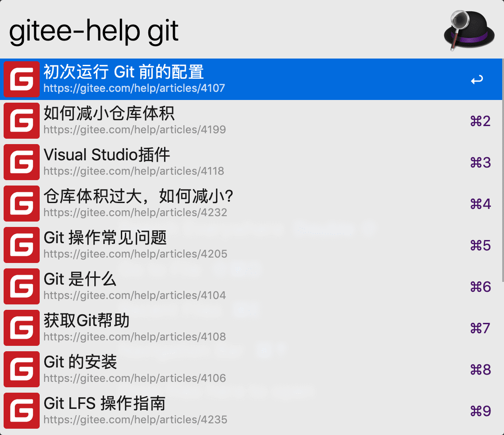
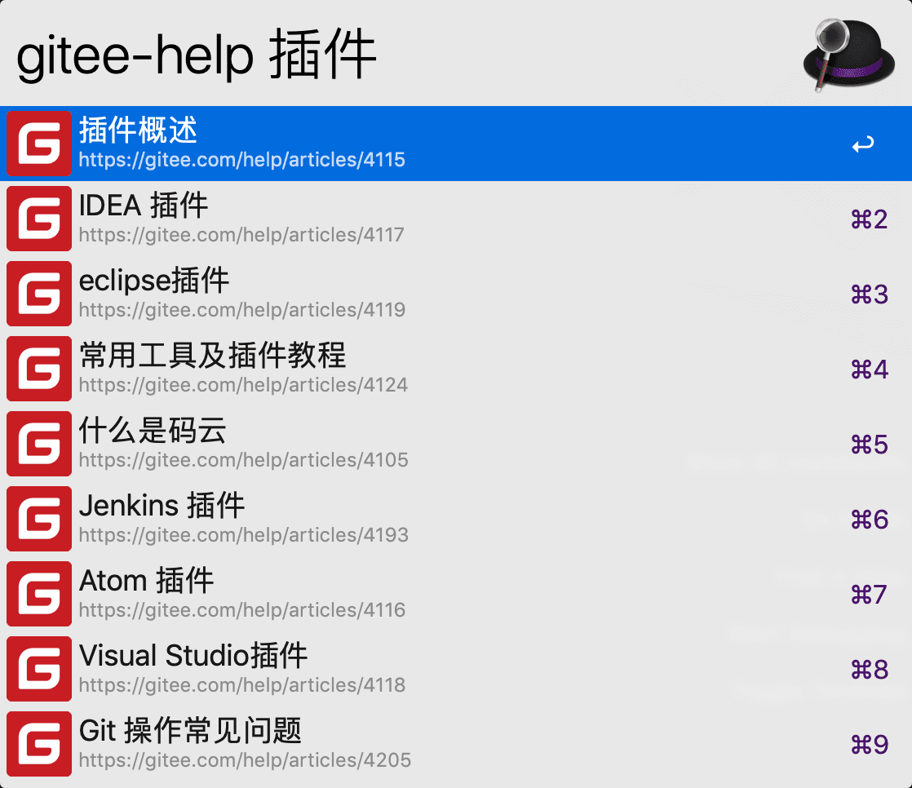

## Gitee Help Searcher for Alfred Workflow

	

	

集成码云（Gitee.com）帮助文档搜索的一款 `Alfred workflow` 插件(不依赖第三方模块)

## 使用说明

### 环境要求

- 操作系统：macOS
- `Alfred workflow` 插件运行在 `Alfred` 上，所以你需要拥有 [Alfred] 并解锁 `Alfred PowerPack`
- 本插件运行需要 [Node.js] 环境

### 下载

通过代码仓库 Git Clone 或下载ZIP包即可。

### 安装
双击 `Gitee Help Searcher.alfredworkflow` 文件即可，插件将自动完成安装。

### 查询

- 在`Alfred`中触发关键字**`gitee-help`**，然后输入想要查询的内容即可。

> Tips: `Alfred 关键字`和`查询内容`之间必须有一个空格

### 打开查询结果

- 使用 `Enter` 复制查询内容的 URL 地址
- 使用 `Command + Enter` 通过浏览器打开查询的内容

## 界面一览

  
[码云]:gitee.com
[Alfred]:www.alfredapp.com
[Node.js]:https://nodejs.org